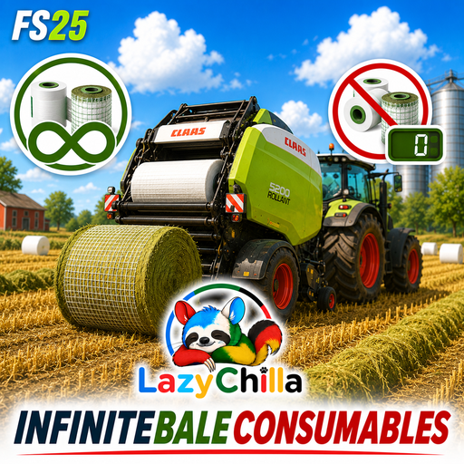

<p align="center">
  
</p>

<h1 align="center">FS25_InfiniteBaleConsumables</h1>

<p align="center">
  Ballennetz, Bindegarn und Wickelfolie werden nicht mehr verbraucht.<br>
  <sub>Farming Simulator 25 &middot; von LazyChilla</sub>
</p>

<p align="center">
  <a href="#deutsch">Deutsch</a> &middot;
  <a href="#english">English</a> &middot;
  <a href="#francais">Français</a> &middot;
  <a href="#italiano">Italiano</a> &middot;
  <a href="#portugues">Português</a> &middot;
  <a href="#espanol">Español</a>
</p>

---

## Deutsch

### Was der Mod macht

Pressen und Wickler verbrauchen kein Netz, kein Garn und keine Folie mehr. Kein
Nachfüllen, keine Leer-Warnung, keine Presse, die mitten im Schwad stehen bleibt.

- Gilt **automatisch für alle** Pressen und Ballenwickler — auch für Mod-Geräte,
  ohne dass an deren Dateien irgendetwas geändert wird.
- Funktioniert auch bei Geräten, die im Shop in der **Konfiguration „Leer"**
  (0 €) gekauft wurden. Ohne den Mod würden die gar nicht erst anfangen zu
  arbeiten.
- Netzrolle und Folienrolle bleiben am Modell **optisch normal** — kein Flackern,
  keine verschwundenen Meshes.
- Von Hand nachfüllen bleibt möglich, schadet aber nicht.

### Installation

1. `FS25_InfiniteBaleConsumables.zip` aus dem [neuesten Release](../../releases/latest)
   herunterladen.
2. In den `mods`-Ordner legen:
   `Dokumente\My Games\FarmingSimulator2025\mods`
3. Im Spiel bei den Mods aktivieren.

Die ZIP **nicht entpacken** und **nicht umbenennen**.

### Multiplayer

Muss auf dem Server **und** bei allen Mitspielern installiert sein.

### Technischer Hintergrund

Der Mod hängt sich an die globale `Consumable`-Spezialisierung des Grundspiels,
nicht an einzelne Fahrzeuge. Erkannt werden die Verbrauchsstoffe über die
GIANTS-Konstanten `Baler.CONSUMABLE_TYPE_NAME_ROUND` (Netz),
`Baler.CONSUMABLE_TYPE_NAME_SQUARE` (Garn) und
`BaleWrapper.CONSUMABLE_TYPE_NAME` (Folie) — nicht über fest verdrahtete
Namen. Ändert GIANTS die internen Bezeichnungen, läuft der Mod weiter.

Drei Eingriffe, alle per `Utils.overwrittenFunction`:

| Funktion | Wirkung |
|---|---|
| `updateConsumable` | Abzüge werden auf 0 gesetzt, aber **durchgereicht** — Meshes, Shader und Animationen laufen normal weiter |
| `getConsumableIsAvailable` | Immer `true` → auch die leer gekaufte Presse legt los |
| `getShowConsumableEmptyWarning` | Immer `false` → keine Leer-Warnung im HUD |

Beim Start meldet sich der Mod im `log.txt`:

```
InfiniteBaleConsumables v1.0.0.0 aktiv: Netz, Garn und Wickelfolie werden nicht mehr verbraucht.
```

Fehlt diese Zeile, ist der Mod nicht aktiv.

### Konsolenbefehle

Die Konsole öffnest du im Spiel mit `~` (Tilde). Beide Befehle sind reine
Diagnose-Werkzeuge und ändern nichts an deinem Spielstand.

| Befehl | Was er tut |
|---|---|
| `ibcStatus` | Zeigt, welche Verbrauchsstoffe erkannt wurden (Netz, Garn, Folie) und ob die Hooks sitzen |
| `ibcToggle` | Schaltet den Mod für die laufende Sitzung an und aus — praktisch zum Gegentesten. Wird **nicht** gespeichert: nach dem nächsten Spielstart ist der Mod wieder aktiv |

*Open the console with `~`. `ibcStatus` shows which consumable types were
detected and whether the hooks are in place; `ibcToggle` switches the mod off
and on for the current session only — not saved.*

### Bekannte Wechselwirkungen

Andere Mods, die ebenfalls am Netzverbrauch drehen, können sich in die Quere
kommen. Wenn Netz trotzdem verbraucht wird, diese Mods testweise deaktivieren.
Getestet und unkritisch: `FS25_AIBaler`, `FS25_UnloadBalesEarly`,
`FS25_Filllevelwarning`.

---

## English

### What it does

Balers and wrappers no longer consume net, twine or wrapping film. No refilling,
no empty warning, no baler stopping in the middle of a windrow.

- Applies **automatically to every** baler and bale wrapper, including modded
  equipment — no changes to their files needed.
- Works for machines bought in the **"empty" shop configuration** (0 €). Without
  this mod those would never start working at all.
- Net and film rolls still look normal on the model — no flickering, no
  disappearing meshes.
- Refilling by hand is still possible and does no harm.

### Installation

1. Download `FS25_InfiniteBaleConsumables.zip` from the
   [latest release](../../releases/latest).
2. Put it into your `mods` folder:
   `Documents\My Games\FarmingSimulator2025\mods`
3. Enable it in the in-game mod list.

Do **not** unpack or rename the ZIP.

### Multiplayer

Must be installed on the server **and** by every player.

### Technical background

The mod hooks the base game's global `Consumable` specialization rather than
individual vehicles. Consumable types are matched against the GIANTS constants
`Baler.CONSUMABLE_TYPE_NAME_ROUND`, `Baler.CONSUMABLE_TYPE_NAME_SQUARE` and
`BaleWrapper.CONSUMABLE_TYPE_NAME` instead of hardcoded strings, so it keeps
working if GIANTS renames them.

Three hooks, all via `Utils.overwrittenFunction`:

| Function | Effect |
|---|---|
| `updateConsumable` | Deductions clamped to 0 but still **passed through** — meshes, shaders and animations keep updating |
| `getConsumableIsAvailable` | Always `true` → even an empty-bought baler starts working |
| `getShowConsumableEmptyWarning` | Always `false` → no empty warning in the HUD |

On startup the mod writes to `log.txt`:

```
InfiniteBaleConsumables v1.0.0.0 aktiv: Netz, Garn und Wickelfolie werden nicht mehr verbraucht.
```

If that line is missing, the mod is not active.

---

## Français

Les presses et enrubanneuses ne consomment plus de filet, de ficelle ni de film.
Plus de remplissage, plus d'avertissement, plus de presse qui s'arrête au milieu
de l'andain.

- S'applique **automatiquement à toutes** les presses et enrubanneuses, y compris
  les machines moddées — aucun fichier de véhicule n'est modifié.
- Fonctionne aussi avec les machines achetées en **configuration « vide »** (0 €).
- Les rouleaux restent visuellement normaux sur le modèle.

**Installation :** télécharger `FS25_InfiniteBaleConsumables.zip` depuis la
[dernière version](../../releases/latest), le placer dans
`Documents\My Games\FarmingSimulator2025\mods`, puis l'activer en jeu. Ne pas
décompresser ni renommer.

**Multijoueur :** doit être installé sur le serveur et chez tous les joueurs.

---

## Italiano

Presse e fasciatrici non consumano più rete, spago o pellicola. Niente ricariche,
nessun avviso di esaurimento, nessuna pressa ferma a metà andana.

- Vale **automaticamente per tutte** le presse e fasciatrici, anche quelle
  moddate — nessun file dei veicoli viene modificato.
- Funziona anche con le macchine acquistate nella **configurazione «vuota»** (0 €).
- I rotoli restano visivamente normali sul modello.

**Installazione:** scaricare `FS25_InfiniteBaleConsumables.zip` dall'
[ultima versione](../../releases/latest), copiarlo in
`Documenti\My Games\FarmingSimulator2025\mods` e attivarlo nel gioco. Non
estrarre né rinominare.

**Multigiocatore:** deve essere installato sul server e da tutti i giocatori.

---

## Português

Enfardadeiras e envolvedoras deixam de consumir rede, fio e filme. Sem
reabastecimento, sem aviso de vazio, sem enfardadeira parada a meio da leira.

- Aplica-se **automaticamente a todas** as enfardadeiras e envolvedoras, incluindo
  equipamento modificado — nenhum ficheiro de veículo é alterado.
- Funciona também com máquinas compradas na **configuração «vazia»** (0 €).
- Os rolos continuam com aspeto normal no modelo.

**Instalação:** transferir `FS25_InfiniteBaleConsumables.zip` da
[versão mais recente](../../releases/latest), colocar em
`Documentos\My Games\FarmingSimulator2025\mods` e ativar no jogo. Não extrair
nem renomear.

**Multijogador:** tem de estar instalado no servidor e em todos os jogadores.

---

## Español

Las empacadoras y encintadoras ya no consumen red, hilo ni film. Sin recargas,
sin aviso de vacío, sin empacadoras paradas en mitad de la hilera.

- Se aplica **automáticamente a todas** las empacadoras y encintadoras, incluido
  el equipamiento de mods — no se modifica ningún archivo de vehículo.
- Funciona también con máquinas compradas en la **configuración «vacía»** (0 €).
- Los rollos mantienen su aspecto normal en el modelo.

**Instalación:** descargar `FS25_InfiniteBaleConsumables.zip` desde la
[última versión](../../releases/latest), copiarlo en
`Documentos\My Games\FarmingSimulator2025\mods` y activarlo en el juego. No
descomprimir ni renombrar.

**Multijugador:** debe estar instalado en el servidor y en todos los jugadores.

---

## Fehler melden / Reporting bugs

Bitte **über GitHub**, nicht über Kommentare auf Downloadseiten — dort geht es
unter und ich sehe es meist gar nicht.

👉 **[Fehler oder Wunsch melden / Report a bug or idea](../../issues/new/choose)**

Es gibt ein Formular, das dich durch die nötigen Angaben führt. **Das Wichtigste
ist die `log.txt`** — ohne sie kann dir niemand helfen. Sie liegt unter:

```
Dokumente\My Games\FarmingSimulator2025\log.txt
```

Bitte die **ganze Datei**, nicht nur die Zeile mit dem Fehler. Der Mod schreibt
beim Start eine eigene Zeile ins Log — fehlt die, war er gar nicht aktiv, und
das ist schon die halbe Diagnose. Bilder kannst du einfach ins Textfeld ziehen,
GitHub lädt sie automatisch hoch.

*Please report via GitHub, not in comments on download sites. There is a form
that walks you through what is needed. The `log.txt` is the important part —
the whole file, not just the error line.*

---

## Changelog

### v1.0.0.0 — 30.07.2026

- Erste Version
- Netz, Garn und Wickelfolie werden nicht mehr verbraucht — drei Hooks auf der
  globalen `Consumable`-Spezialisierung
- Funktioniert auch für leer gekaufte Geräte (0-€-Shop-Konfiguration)
- Konsolenbefehle `ibcStatus` und `ibcToggle`

---

## Credits

- **LazyChilla** — Idee, Code, Umsetzung / idea, code, implementation

Dieser Mod enthält keine Inhalte anderer Ersteller.
*This mod contains no third-party content.*

## Lizenz / License

Siehe [`LICENSE.md`](LICENSE.md). Kurzfassung: Code und Lösungen dürfen mit
Nennung von LazyChilla weiterverwendet werden, nicht gegen Geld, Weitergabe
unter denselben Bedingungen. Den Mod als Ganzes neu hochladen bitte vorher
kurz anfragen.

*Short version: reuse code and solutions with credit to LazyChilla, never for
money, pass it on under the same terms. Ask before re-uploading the mod as a
whole.*
